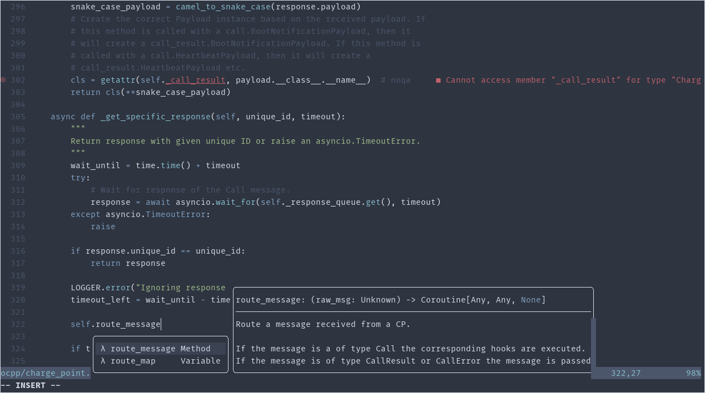
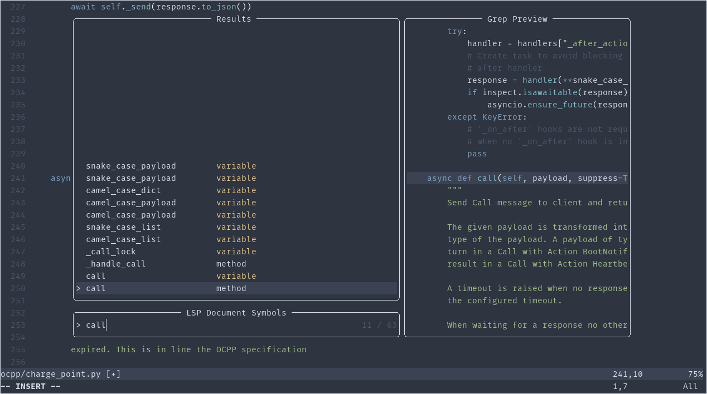

# Dotfiles

## nvim
nvim/ contains configuration for nvim. Copy the content of nvim/ to ~/.config.
Install [packer](https://github.com/wbthomason/packer.nvim). Now, start nvim
and run `:PackerSync` to install all dependencies..

Next, run `:MasonInstall bash-language-server black pyright rust-analyzer`.

Some packages might depend on `npm`. Make sure to install that.

The configuration is tailored to Python and Rust development.

### Symbols
Some key maps:

Key combinations | action 
---|---
`gd` | Go to definition of symbol under cursor
`ga` | Show all symbols in workspace
`g0` | Show all symbols in buffer
`K`  | Display information of symbol under cursor (e.g type or documentation) 
`<Leader>r` | Rename symbol under cursor

### Misc
Some key maps:

Key combinations | action 
---|---
`<Leader>b` | Format buffer
`<Leader>a` | Show code actions in quick fix window
`<Leader>ff` | Find file in workspace
`<Leader>dn` | List all diagnstics in workspace.

### Screenshots

**Auto-complete in Python.**

**Find symbol in buffer.**

